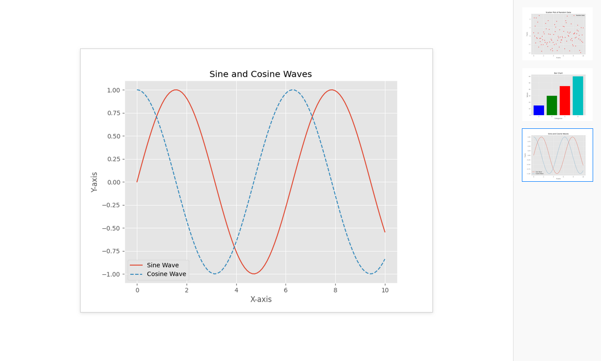

# `httpplot`
----------------

A lightweight, interactive plotting backend and web viewer for matplotlib; inspired by R's `httpgd`. Plots are displayed in real-time in your browser with a scrollable history of previous plots. Great for live development, exploration, and REPL workflows.

`httpplot` UI in browser:



## Features

- Real-time plot updates in the browser
- `httpgd`-inspired UI with a scrollable plot history
- Clean and minimal using Flask and vanilla JS
- Save and copy plot images from browser

Get started in only 2 lines of code!

### Planned Features

- [ ] Rich display of dataframes and tabular data
- [ ] Integration as a custom `matplotlib` backend for easy use ( `matplotlib.use("module://httpsplot.backend")`)
- [ ] Extensibility and custom HTML templates for plot viewer.

## Quick start
```bash
git clone https://github.com/dominicgmancini/httpplot.git
cd httpplot
pip install .
```

## Usage

Checkout and use the [`example.py`](./example.py) file to get started.


```python
from httpplot import start_server

# start server and automatically open browser
start_server()

# Create plots to display
import matplotlib.pyplot as plt
fig, ax = plt.subplots()
ax.plot([1, 2, 3, 4])

# display plot
plt.show()

# server will automatically end when exiting script/quitting REPL.
```

## Dependencies


```bash
matplotlib
flask
waitress
```

## About


`httpplot` is released under the [MIT License](https://github.com/domancini/httpplot/blob/main/LICENSE)

### Authors
